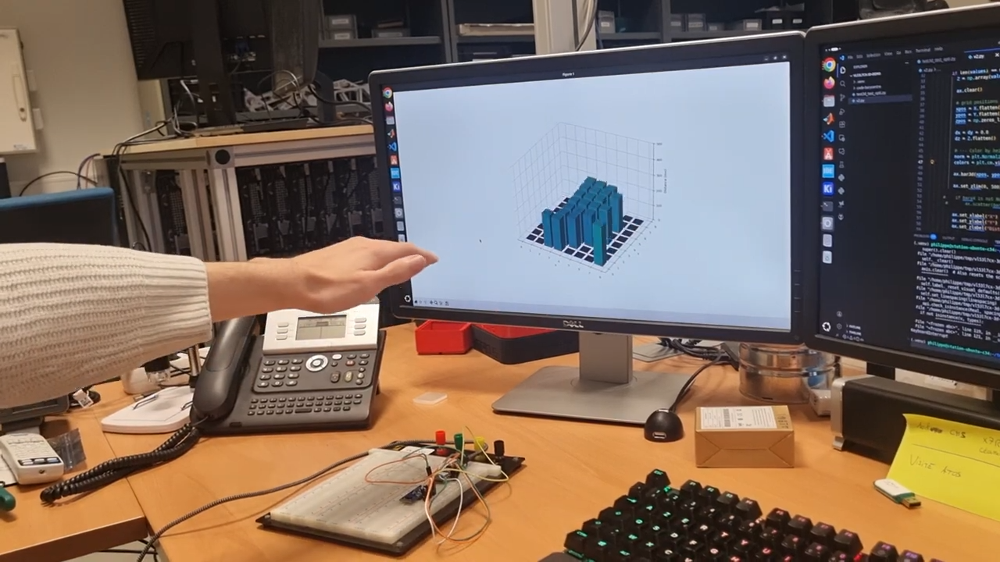
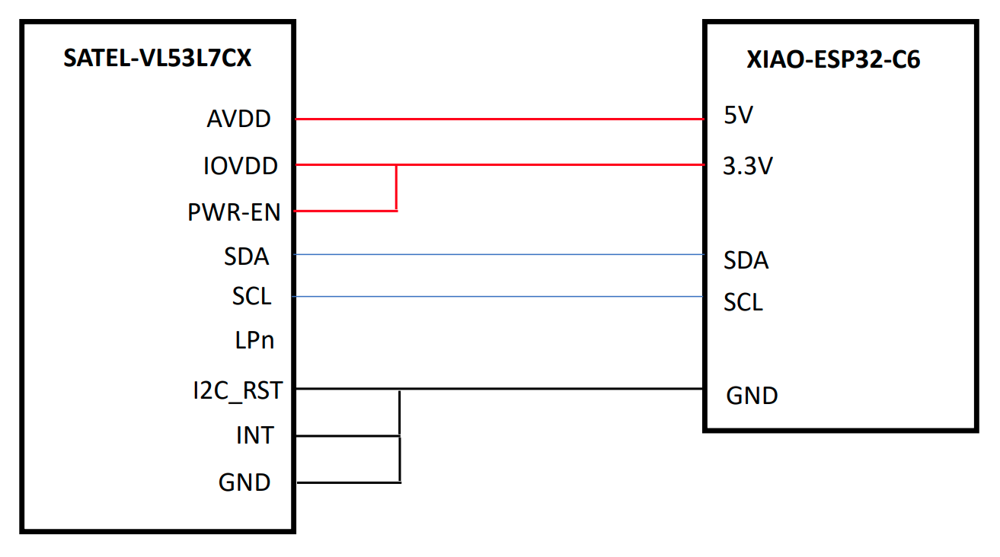
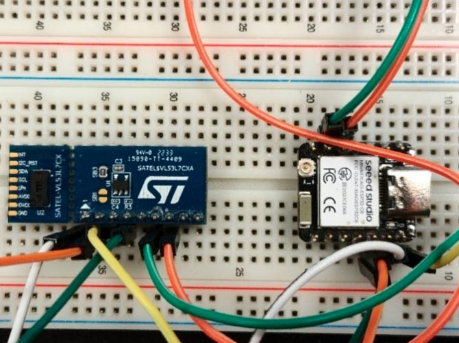

# VL53L7CX Demo

## Components

- ESP32C6: [XIAO ESP32-C6](https://wiki.seeedstudio.com/xiao_esp32c6_getting_started/)
- VL53L7: [SATEL-VL53L7
](https://www.st.com/en/evaluation-tools/satel-vl53l7.html)

## Wiring
The image shows the wiring of the electronic circuit.

Here is the physical wiring on the breadboard:

